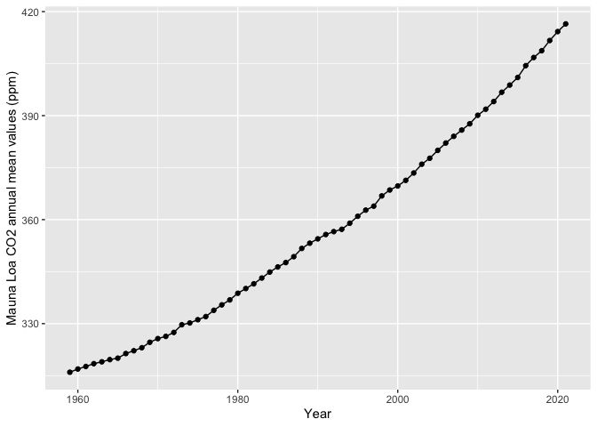

CS_08
================
Yue Ma
9/20/2022

## Data collection

read the txt data from the website

## draw the figures

Make the line plot of CO2 emission

<!-- -->

## get the top five years for CO2 emission

draw the table

<!-- -->

Note that the `echo = FALSE` parameter was added to the code chunk to
prevent printing of the R code that generated the plot.
