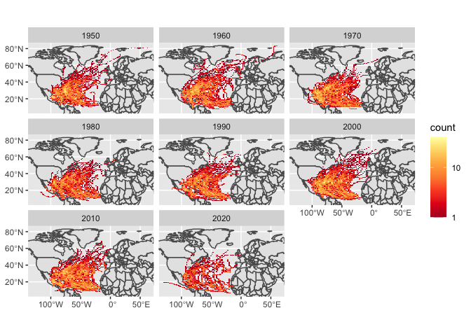

CS_09
================
Yue Ma
10/31/2022

## Download the data

In this part we download the storm data we need and read it.

``` r
# Download zipped data from noaa with storm track information
dataurl="https://www.ncei.noaa.gov/data/international-best-track-archive-for-climate-stewardship-ibtracs/v04r00/access/shapefile/IBTrACS.NA.list.v04r00.points.zip"

tdir=tempdir()
download.file(dataurl,destfile=file.path(tdir,"temp.zip"))
unzip(file.path(tdir,"temp.zip"),exdir = tdir) #unzip the compressed folder
storm_data <- read_sf(list.files(tdir,pattern=".shp",full.names = T))
```

## Filter the data

In this part we filter out the data and prepare it for the
visualization.

``` r
storm_data_filter <- storm_data %>% filter(SEASON >= 1950)
storm_data_withNA <- storm_data_filter %>% mutate_if(is.numeric, function(x) ifelse(x==-999.0,NA,x))
storms <- storm_data_withNA %>% mutate(decade=(floor(year/10)*10))
region <- st_bbox(storm_data_withNA)
```

Note that the `echo = FALSE` parameter was added to the code chunk to
prevent printing of the R code that generated the plot.

## Visualize the result

In this part we visualize the result we get from previous step.

``` r
ggplot()+
  geom_sf(data=world, inherit.aes=F)+
  facet_wrap(~decade)+
  stat_bin2d(data=storms, aes(y=st_coordinates(storms)[,2],x=st_coordinates(storms)[,1]),bins=100)+
  scale_fill_distiller(palette="YlOrRd", trans="log", direction=-1, breaks = c(1,10,100,1000))+
  coord_sf(ylim=region[c(2,4)], xlim=region[c(1,3)])+
  theme(axis.title=element_blank())
```

<!-- -->

## Create the table

In this part we create the table that shows the top five states attacked
by the storms from 1950 to present.

``` r
states <- st_transform(us_states, crs=st_crs(storms))
colnames(states)[colnames(us_states) == "NAME"] <- "STATE"
storm_states <- st_join(storms, states, join = st_intersects,left = F) %>%
  group_by(STATE) %>%
  summarize(storms=length(unique(NAME))) %>%
  arrange(desc(storms)) %>%
  slice(1:5) %>%
  st_set_geometry(NULL)

kable(storm_states)
```

| STATE          | storms |
|:---------------|-------:|
| Florida        |     86 |
| North Carolina |     66 |
| Georgia        |     58 |
| Texas          |     54 |
| Louisiana      |     52 |
