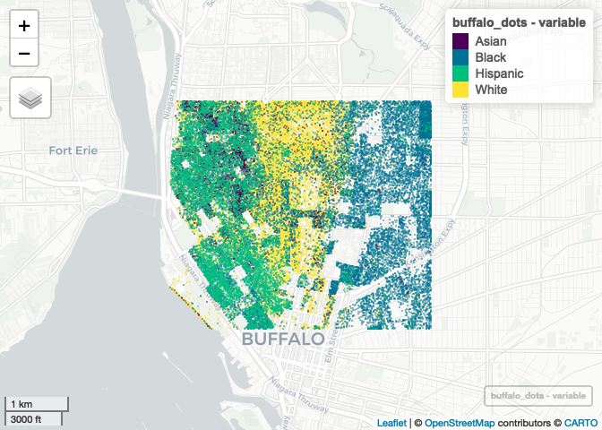

CS_11
================
Yue Ma
11/16/2022

``` r
library(tidyverse)
```

    ## ── Attaching packages ─────────────────────────────────────── tidyverse 1.3.1 ──

    ## ✔ ggplot2 3.4.0      ✔ purrr   0.3.5 
    ## ✔ tibble  3.1.8      ✔ dplyr   1.0.10
    ## ✔ tidyr   1.2.1      ✔ stringr 1.4.1 
    ## ✔ readr   2.1.3      ✔ forcats 0.5.1

    ## ── Conflicts ────────────────────────────────────────── tidyverse_conflicts() ──
    ## ✖ dplyr::filter() masks stats::filter()
    ## ✖ dplyr::lag()    masks stats::lag()

``` r
library(spData)
```

    ## To access larger datasets in this package, install the spDataLarge
    ## package with: `install.packages('spDataLarge',
    ## repos='https://nowosad.github.io/drat/', type='source')`

``` r
library(sf)
```

    ## Linking to GEOS 3.10.2, GDAL 3.4.2, PROJ 8.2.1; sf_use_s2() is TRUE

``` r
## New Packages
library(mapview) # new package that makes easy leaflet maps
library(foreach)
```

    ## 
    ## Attaching package: 'foreach'

    ## The following objects are masked from 'package:purrr':
    ## 
    ##     accumulate, when

``` r
library(doParallel)
```

    ## Loading required package: iterators

    ## Loading required package: parallel

``` r
registerDoParallel(4)
getDoParWorkers() # check registered cores
```

    ## [1] 4

# use API key

``` r
library(tidycensus)
census_api_key("05670ba5a977c8507163268643ea67909e32759c",install = TRUE, overwrite = TRUE)
```

    ## Your original .Renviron will be backed up and stored in your R HOME directory if needed.

    ## Your API key has been stored in your .Renviron and can be accessed by Sys.getenv("CENSUS_API_KEY"). 
    ## To use now, restart R or run `readRenviron("~/.Renviron")`

    ## [1] "05670ba5a977c8507163268643ea67909e32759c"

# download the data

``` r
library(tidycensus)
racevars <- c(White = "P005003", 
              Black = "P005004", 
              Asian = "P005006", 
              Hispanic = "P004003")

options(tigris_use_cache = TRUE)
erie <- get_decennial(geography = "block", variables = racevars, 
                  state = "NY", county = "Erie County", geometry = TRUE,
                  summary_var = "P001001", cache_table=TRUE) 
```

    ## Getting data from the 2010 decennial Census

    ## Using Census Summary File 1

# parallel computing

``` r
buffalo <- erie %>% 
   st_crop(c(xmin=-78.9,xmax=-78.85,ymin=42.888,ymax=42.92))
```

    ## Warning: attribute variables are assumed to be spatially constant throughout all
    ## geometries

``` r
buffalo_dots=
   foreach(r=unique(buffalo$variable),.combine=rbind)%dopar%{
   filter(buffalo,variable==r) %>%  #do one variable at a time
   st_sample(size=.$value) %>%  #generate a point for each person randomly
   st_as_sf() %>%  #convert to a full sf object
   mutate(variable=r) #add the variable onto the points
   }
```

``` r
mapview(buffalo_dots, zcol = "variable",cex = 0.01,alpha = 0)
```

<!-- -->
